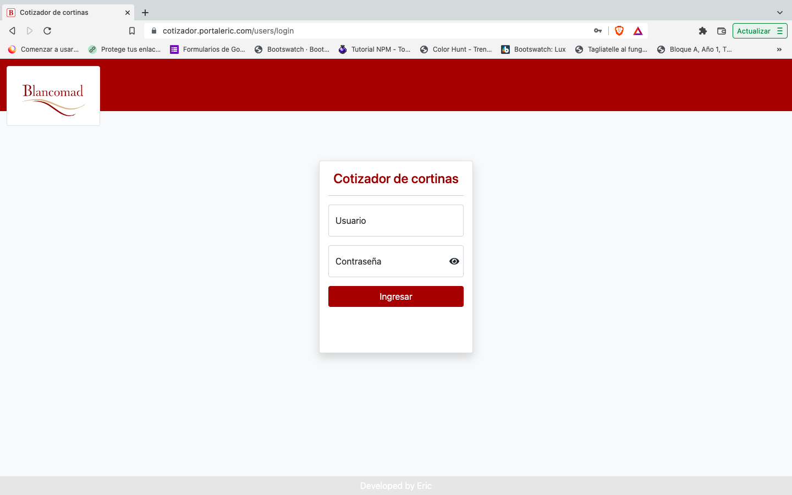
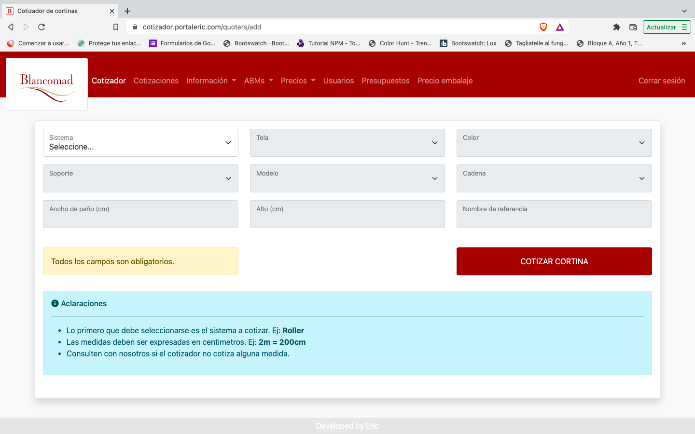

# COTIZADOR DE CORTINAS
> Developed by Eric for Blancomad
## Indice
- [COTIZADOR DE CORTINAS](#cotizador-de-cortinas)
  - [Indice](#indice)
    - [Información General](#información-general)
    - [Screenshot](#screenshot)
  - [Dependencias](#dependencias)
  - [Instalación](#instalación)
  - [Base de datos](#base-de-datos)
    - [Crear la base de datos con **migraciones**](#crear-la-base-de-datos-con-migraciones)
    - [Crear la base de datos ejecutando un script](#crear-la-base-de-datos-ejecutando-un-script)
  - [Deploy](#deploy)
### Información General
***
Siio web creado con Node y Express que tiene como finalidad generar cotizaciones de cortinas, según el sitema, tela y color elegido. El usuario administrador puede registrar usuarios con distintos roles: control, medidor, vendedor y asignarles un coeficiente que incidirá en el precio final de la cotización.
### Screenshot




## Dependencias
***
Dependencias utilizadas en el proyecto:
    [bcryptjs](https://www.npmjs.com/package/bcryptjs): "^2.4.3",
    [bootstrap](https://www.npmjs.com/package/bootstrap): "^5.1.3",
    [cookie-parser](https://www.npmjs.com/package/cookie-parser): "~1.4.4",
    [create-html](https://www.npmjs.com/package/create-html): "^4.1.0",
    [debug](https://www.npmjs.com/package/debug): "~2.6.9",
    [dotenv](https://www.npmjs.com/package/dotenv): "^10.0.0",
    [ejs](https://www.npmjs.com/package/ejs): "~2.6.1",
    [emailjs](https://www.npmjs.com/package/emailjs): "^3.7.0",
    [express](https://www.npmjs.com/package/express): "~4.16.1",
    [express-session](https://www.npmjs.com/package/express-session): "^1.17.2",
    [express-validator](https://www.npmjs.com/package/express-validator): "^6.14.0",
    [http-errors](https://www.npmjs.com/package/http-errors): "~1.6.3",
    [jsdom](https://www.npmjs.com/package/jsdom): "^19.0.0",
    [method-override](https://www.npmjs.com/package/method-override): "^3.0.0",
    [moment](https://www.npmjs.com/package/moment): "^2.29.1",
    [morgan](https://www.npmjs.com/package/morgan): "~1.9.1",
    [multer](https://www.npmjs.com/package/multer): "^1.4.4",
    [mysql2](https://www.npmjs.com/package/mysql2): "^2.3.3",
    [pdfmake](https://www.npmjs.com/package/pdfmake): "^0.2.4",
    [sequelize](https://www.npmjs.com/package/sequelize): "^6.12.5",
    [xlsx](https://www.npmjs.com/package/xlsx): "^0.18.4"
## Instalación
***
Clonar el proyecto e instalar las dependencias
```
$ git clone https://github.com/EricM76/cotizador
$ cd cotizador
$ npm install

```
Renombrar el arhivo <code>.env.example</code> por <code>.env</code> y darle valor a las variables de entorno según corresponda.
```
DB_DEV_USERNAME=
DB_DEV_PASSWORD=
DB_DEV_DATABASE=
DB_DEV_HOST=
DB_DEV_PORT=

DB_PROD_USERNAME=
DB_PROD_PASSWORD=
DB_PROD_DATABASE=
DB_PROD_HOST=
DB_PROD_PORT=

NODE_ENV=development

```
## Base de datos
***
### Crear la base de datos con **migraciones**
Es necesario tener instalado [sequelize-cli](https://www.npmjs.com/package/sequelize-cli)
```
$ npm install --save-dev sequelize-cli
```
Correr migraciones y seeders
```
$ sequelize db:migrate
$ sequelize db:seed:all
```
### Crear la base de datos ejecutando un script
Correr el script de SQL: <code>/src/data/cotizador.sql</code> para crear la estructura y cargar los datos.
## Deploy
***
Es necesario habilitar el acceso de *escritura* a las siguientes carpetas:
- <code>/src/data</code> 
- <code>/src/downloads</code>